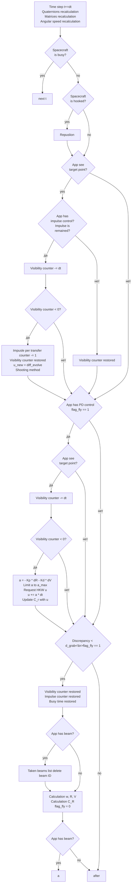

Используются функции: 
- [[граф decision |Decision]]
- [[граф diff_evolve|Differential evolution]]

```mermaid
flowchart TD;
	id1[Time step t+=dt</br>Quaternions recalculation</br>Matrices recalculation</br>Angular speed recalculation]-->id7{Spacecraft </br>is busy?}
	id7-->|yes|id8[next t]
	id7-->|no|id9{Spacecraft <br>is hooked?}
	id9-->|yes|id10[Repuslion]
	id9-->|no|id11{App see </br>target point?}
	id10-->id11
	id11-->|yes|id12{App has</br>impulse control?</br>Impulse is </br>remained?}
	id12-->|да|id13[Visibility counter -= dt]
	id13-->id14{Visibility counter < 0?}
	id14-->|да|id15[Impusle per transfer counter -= 1</br>Visibility counter restored</br>u_new = diff_evolve</br>Shooting method]
	id14-->|нет|id17
	id12-->|нет|id16[Visibility counter restored]
	id16-->id17
	id11-->|нет|id17
	id15-->id17{App has PD control</br>flag_fly == 1}
	id17-->|да|id18{App see </br>target point?}
	id18-->|да|id19[Visibility counter -= dt]
	id19-->id20{Visibility counter < 0?}
	id20-->|да|id21[a = - Kp * dR - Kd * dV</br>Limit a to a_max</br>Request HKW u</br>u += a * dt</br>Update C_r with u]
	
	id20-->|нет|id22
	id18-->|нет|id22
	id21-->id22
	id17-->|нет|id22{Discrepancy < d_grab<\br>flag_fly == 1}
	id22-->|yes|id23[Visibility counter restored</br>Impulse counter restored</br>Busy time restored</br>]
	id23-->id24{App has beam?}
	id24-->|yes|id25[Taken beams list delete beam ID]
	id25-->id26
	id24-->|no|id26[Calculation w, R, V</br>Calculation C_R</br>flag_fly = 0]
	id26-->id27{App has beam?}
	id27-->|yes|id28[a]
	id27-->|no|id[after]
	
	id22-->|no|id[after]
```
