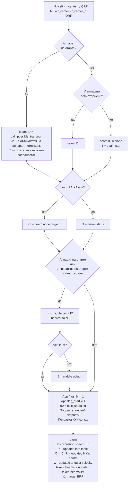

```mermaid
flowchart TD;
	id0[r = R + r0 - r_center_p ORF</br>R += r_center - r_center_p ORF]-->id1
	id1{Аппарат </br>на старте?}-->|да|id2[beam ID = call_possible_transport</br>Jp, Jn отличаются на аппарат и стержень</br>Список взятых стержней пополняется]
	id1-->|нет|id3{У аппарата </br>есть стержень?}
	id3-->|да|id4[beam ID]
	id3-->|нет|id5[beam ID = None</br>r1 = beam start]
	id2-->id6{beam ID is None?}
	id4[beam ID]-->id6{beam ID is None?}
	id5-->id6{beam ID is None?}
	id6-->|да|id7[r1 = beam start r]
	id6-->|нет|id8[r1 = beam node target r]
	id8-->id9{Аппарат на старте</br>или</br>Аппарат не на старте</br>и без стержня}
	id7-->id9
	id9-->|да|id10[m = middle point ID </br> nearest to r1]
	id10-->id11{App in m?}
	id11-->|нет|id12[r1 = middle point r]
	id11-->|да|id13[App flag_fly = 1</br>App flag_start = 1</br>u0 = calc_shooting</br>Поправка угловой скорости</br>Поправка ХКУ consts]
	id12-->id13
	id9-->|нет|id13
	id13-->id14[return:<br>u0 - repulsion speed BRF<br>X - updated info table<br>C_r, C_R  - updated HKW contst</br>w - updated angular velocity</br>taken_beams  - updated taken beams list</br>r1 - target BRF]
```